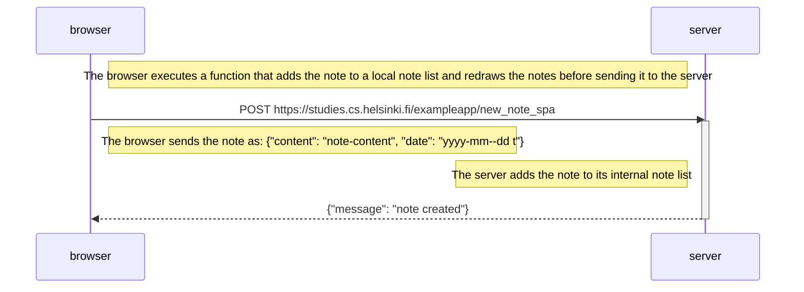

```mermaid
sequenceDiagram
    participant browser
    participant server

    Note right of browser: The browser executes a function that adds the note to a local note list and redraws the notes before sending it to the server

    browser->>server: POST  https://studies.cs.helsinki.fi/exampleapp/new_note_spa
    activate server
    Note right of browser: The browser sends the note as: {"content": "note-content", "date": "yyyy-mm--dd t"}
    Note left of server: The server adds the note to its internal note list
    server-->>browser: {"message": "note created"}
    deactivate server

    
```